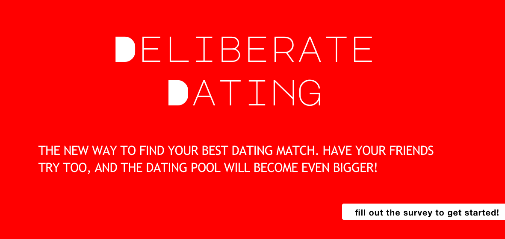

# Deliberate Dating
## A dating app for those who want to be matched on the most important values

### Created By Christie Byrne

### Try it out at https://friendsssss.herokuapp.com/ !

## Getting Started
To install the application follow the instructions below:

                                                                        git clone git@github.com/byrnec/FriendFinder.git
                                                                        cd FriendFinder
                                                                        npm install

# Purpose of the Game
The Friend Finder is a dating application where users can take a ten question survey about themselves and then be appropriately matched with a mate based on their answers. The app displays the name and picture of the user with the best overall match. The application is run using a Node.js and Express server on the back end and the CSS Bootstrap framework on the front end. 

# Main Features of the game

* 10-question survey to assess characteristics of the users stored as an array of objects
* Use express, body-parser, and path npm packages in the server.js file
    *   You can visit npmjs.com for info on API packages used (body-parser, express were used in this project)
* Separate JavaScript files for routing (htmlRoutes.js and apiRoutes.js)
* GET and POST routes for serving HTML pages and API calls

## Technologies Used
* JavaScript
* jQuery
* node.js
* Express.js
* HTML
* Bootstrap